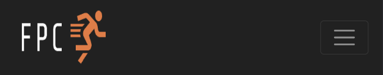

# FPC - Free-running and Parkour Centre

## Introduction

FPC is a free-running and parkour center operating outdoors in Swansea, Wales. This README provides an overview of the FPC project and its website, which is targeted towards potential clients interested in learning more about FPC, its offered classes, and available subscription plans.

Welcome to [FPC](https://sergpapa.github.io/FPC/)

# Contents

- [FPC - Free-running and Parkour Centre](#fpc---free-running-and-parkour-centre)
  - [Introduction](#introduction)
- [Contents](#contents)
- [User Experience (UX)](#user-experience-ux)
  - [User Stroies](#user-stroies)
  - [Wireframes](#wireframes)
  - [Site Structure](#site-structure)
  - [Design](#design)
- [Features](#features)
  - [Existing features](#existing-features)
  - [Future Features](#future-features)
- [Technologies Used](#technologies-used)
- [Testing](#testing)
- [Deployment](#deployment)
  - [To deploy the project](#to-deploy-the-project)
  - [To fork the repository on GitHub](#to-fork-the-repository-on-github)f
  - [To create a local clone of this project](#to-create-a-local-clone-of-this-project)
- [Credits](#credits)
- [Acknowledgements](#acknowledgements)

# User Experience (UX)

## User Stroies

- As a visitor, I want a navigation bar on each page, so that I can easily navigate through all the different pages - home, plans, gallery, and contact - of the website.
- As a visitor I want a captivating, descriptive and easy to understand home page so that I can understand the purpose of the website and get a brief overview about the parkour centre and what it offers.
- As a visitor I want a plans page where I can see different classes and subscription plans, so that I can make a decision on what class or subscription plan suits me.
- As a visitor I want a gallery page where I can see images of the parkour centre and people performing parkour, so that I can visualize what training looks like and what to expect during classes.
- As a visitor I want a contact page where I can get contact details of the centre and a contact form, so that I can reach out to the centre for more details or register my queries.
- As a visitor I want social media icons on footer of each page, so that I can visit the parkour centre’s social media pages for their latest updates and activities.
- As a visitor I want a website that is easy to navigate, and pages that load quickly,, so that I can find the information I need without any confusion or delays.
- As a visitor I want a website that functions well and looks good on all platforms, whether it's a desktop, tablet, or mobile, so that I can access the information comfortably, regardless of which device I am using.
- As a visitor I want a website I can navigate through using keyboard or screen reader, so that I can interact with the website even if I have accessibility needs.

[Back to top](<#contents>)

## Wireframes

The wireframes for FPC were produced in [Balsamiq](https://balsamiq.com). Inclued below, frames can be found for all distinct pages (home, plans, gallery, contact) in desktop, mobile and tablet view as they were initially envisioned.

- Home Page:

 

- Plans Page:
  

  
- Gallery Page:
  

- Contact Page:

[Back to top](<#contents>)

## Site Structure

The site consists of four pages with the main landing page being the [home page](https://sergpapa.github.io/FPC/). Additionaly, there are the [plans page](https://sergpapa.github.io/FPC/plans.html), [gallery page](https://sergpapa.github.io/FPC/gallery.html) and [contact page](https://sergpapa.github.io/FPC/contact.html). Other than that, there is also a [thank you page](https://sergpapa.github.io/FPC/thank-you.html) that visitors are redirected to when submitting their details to be contacted and there are links to social media platforms in the footer element of each page.

[Back to top](<#contents>)

## Design

- Typography

All thxt on the website is using a variation of the "Rubik" font family found on [Google Fonts - Rubik](https://fonts.google.com/specimen/Rubik?query=rubik)

- Colour palette

The colors chosen for the website revolve around three colors: eerie black, platinum and crayola orange. Orange as a color usually represents energy and vitality with the black tone gives the impression of elegance and simplicity. Additionally, dark tones provide a visually comfortable experience that minimizes screen fatigue and promotes extended periods of use.

[Back to top](<#contents>)

# Features

The FPC wesite is designed to be simple to nacigate and ieay to use. It includes a variety of features commonly found in most websites such as a navigation bar, a photo gallery and a review section.

## Existing features

- ### Navigation Menu

    Can be found on the top side of all pages of the websites. Makes navigation through pages easy and intuitive.
    The navigation manu is fully responsive to accomodate users of all decvces. In smaller devices the navigation menu appears as a dropdown menu instead placed in the header of each serarate page. The active page is always underlined and orange. Any other manu item reacts the same when hovered over with the mouse to increase usability.

  - Navigation Menu Bigger screens

    

  - Navigation Menu Smaller screens

    

- ### Hero Image
  
    A nice intriguilg parkour photo to immediately capture the attention of the visitor and provide a clear visual description of what the website is all about.

  - Hero Image Home Page
  
  

- ### Callout
  
    The callout feature, sitting just below the hero image, aims to grab the attention of the visitor, encourage them to engage with parkour and the FPC, explain the main theme of the website and provide an easy way to navigate to the contact page with a JOIN US TODAY button.

  - Callout

    

- ### Reasons to start parkour

    This feature is all about explaining in a few words what are the benfits of parkour and free-running. This section educates the visitor and inspires them to join the FPC and subscribe to a plan. The reasons provided are accompanied by visual icons to make understanding more intuitive.

  - Reasons to start parkour

    

- ### Free-running and Parkour Video
  
    In order to provide a more immersive expereince and inspire visitor's even more, this section embeds a short music video from YouTube, with a Creative Commons liscence, showcasing people exercising parkour. The video can be watched on the webisite in a windowed or full screen mode, or one can chose to be redirected to YouTube to watch it on a new page.

  - Free-runners of the world

    

- ### Reviews

  The reviews section will give the visitors the opportunity to look at testimonials from previous clients. Reviews include a title, start rating, text desxription and name to provide full transparency and a layered review depth so that somebody could get an idea from a single glance bit can also explore people's experience in more detail if they are interested in learning more.
  
  - Reviews Section

    

- ### Footer
  
  The footer appears at the end of every page providing links to the FPC social media accounts for people that want to engage with the project more, connect and follow their latest news and updates. Social media links also change color when hovered over with the mouse to add clarity usability.
  
  - Footer

    

- ### Classes
  
  In this section visitor's can find infromation conserning classes that are available at FPC, such as the days and times of each class. Classes are presented in flip cards, featuring an image on the front side and details on the back. This user-friendly design allows visitors to focus solely on the classes that pique their interest, eliminating the need to sift through excessive information and ensuring a streamlined browsing experience

  - Classes

    

- ### Plans
  
  In this section users can find information about the available subscription plans at FPC. Each plan is enclosed in a bordered section, ensuring clarity and understandability. When hovered over, a box will light up, making for a better, more intuitive user experience. Just below the available plan boxes, there is a JOIN US TODAY button that a user can click and be redirected to the contact page after they got all the indromation they needed.
  
  - Plans

    

- ### Gallery
  
  The gallery has a dedicated page for itself as to avoid congestion of information. In the gallery page one can explore moments of parkour and free-running activities at the FPC classes and events, get a taste of what is like to be a part of the FPC group, how training looks like, parkour and free-running expercises as well as more cinematic shots featuring some of our top athletes. The gallery os organised as a photo-grid with no spacing between photos, to amplify the feeling of closeness and bonding the people at the FPC promote between their members.

  - Gallery

    

- ### Contact form
  
  In this section, which is intended to be the end of the user journey so far, the user, after having gathered all the information needed around FPC, the classes and subscription plans available, images of how it is like to be a member of FPC and reviews from past customers, they can engage directly with the Centre to possibly set up a meeting or a call, ask more details around the schedule or the availble plans and any other issue they might have encountered. The form consists of a set of requitrd fields, their name, email address and phone number and a free textarea where they can make their inquiries or specify any issues or conserns.

  - Contact Form
  
  

- ### Contact Info
  
  Just below the contact form, there is a section including the FPC's contact information, such as phone number, email and address. There is also a map embeded for convenience and usability.
  
  - Contact Info

  

- ### Thank you page
  
  Last but not least, when a user submits a contact form to be contacted by the FPC, they are redirected to a Thank You page, where they get a confirmation that their message has been delivered and are provided with a link to return to the home page, in case they want to coninue browsing the webpage.

  - Thank you page
  
  

[Back to top](<#contents>)

## Future Features

- Implementing an online subscription feature where users will be able to subscribe to a plan directly from the website.
  - Create personalised profiles and add electronic payments
- Add an events page to showcase all our hosted events and competitions along with a participation form.
- Add a careers page where all job openings will be posted and people could contact FPC regarding joining the team.
  
[Back to top](<#contents>)

# Technologies Used

- [HTML5](https://html.spec.whatwg.org) - content and structure of the website
- [CSS3](https://www.w3.org/Style/CSS/Overview.en.html) - styling
- [Bootstrap 4.5](https://getbootstrap.com/docs/4.5/getting-started/introduction/) - styling frameworks
- [Balsamiq](https://balsamiq.com) - wireframes
- [GitHub](https://github.com) - Hosting and storing
- [Codeanywhere](https://codeanywhere.com) - coding workspace
- [GIMP](https://www.gimp.org) - image editing
  
[Back to top](<#contents>)

# Testing

Please follow this [link](/) to learn more about testing FPC.

[Back to top](<#contents>)

# Deployment

### To deploy the project

The site was deployed to GitHub pages. The steps to deploy a site are as follows:

  1. In the GitHub repository, navigate to the **Settings** tab.
  2. Once in Settings, navigate to the **Pages** tab on the left hand side.
  3. Under **Source**, select the branch to **master**, then click **save**.
  4. Once the master branch has been selected, the page will be automatically refreshed with a detailed ribbon display to indicate the successful deployment.

  The live link to the Github repository can be found here - [https://sergpapa.github.io/FPC/](https://sergpapa.github.io/FPC/)

### To fork the repository on GitHub

A copy of the GitHub Repository can be made by forking the GitHub account. This copy can be viewed and changes can be made to the copy without affecting the original repository. Take the following steps to fork the repository;

1. Log in to **GitHub** and locate the [repository](https://github.com/sergpapa/FPC).
2. On the right hand side of the page inline with the repository name is a button called **'Fork'**, click on the button to create a copy of the original repository in your GitHub Account.

### To create a local clone of this project

The method from cloning a project from GitHub is below:

1. Under the repository’s name, click on the **code** tab.
2. In the **Clone with HTTPS** section, click on the clipboard icon to copy the given URL.

3. In your IDE of choice, open **Git Bash**.
4. Change the current working directory to the location where you want the cloned directory to be made.
5. Type **git clone**, and then paste the URL copied from GitHub.
6. Press **enter** and the local clone will be created.

[Back to top](<#contents>)

# Credits

- Font: [Google Fonts](https://fonts.google.com)
- Icons: [Fontawesome](https://fontawesome.com)
- Video: [YouTube](https://www.youtube.com)
- Images [Shutterstock](https://www.shutterstock.com), [Unsplash](https://unsplash.com), [Free Images](https://free-images.com)
- Logo: [Shopify logo maker (Hatchful)](https://www.shopify.com/tools/logo-maker)
- Map: [Google Maps](https://www.google.com/maps)
- Wireframes: [Balsamiq](https://balsamiq.com)
- Flip cards: [w3schools](https://www.w3schools.com)
- Absolute Centering: [Medium-Manisha Basra](https://medium.com/front-end-weekly/absolute-centering-in-css-ea3a9d0ad72e)
- Image Editing: [GIMP 2.10.34](https://www.gimp.org)
- Color Palette: [Coolors](https://coolors.co)

[Back to top](<#contents>)

# Acknowledgements

This website was developed as a part of my Portfolio 1 Project for the Web Application Developemnt Diploma at the [Code Institute](https://codeinstitute.net/). I want to express my gratitude to my mentor, [Precious Ijege](https://www.linkedin.com/in/precious-ijege-908a00168/), as well as the Slack community and everyone at the Code Institute for their valuable assistance and support throughout this project. It's important to note that FPC is a fictional company, with everything being entirely conceptual.

Sergios Papastergiou
2023
