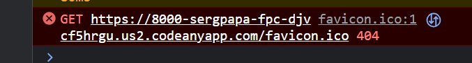
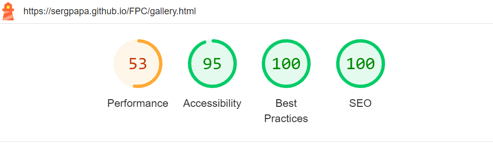
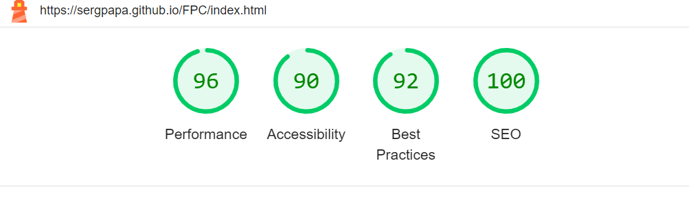

# **TESTING**

The FPC has been tesytd manually as well as with automated services like code validators and browser developer tools.

# **Contents**

- [Code Validators](#code-validators)
  - [w3schools HTML Validator](#w3schools-html-validator)
  - [w3schools CSS Validator](#w3schools-css-validator)
- [Responsiveness Test](#responsiveness-test)
- [Browser Compatibility](#browser-compatibility)
- [Testing User Stories](#testing-user-stories)
- [Known Bugs](#known-bugs)
  - [Resolved](#resolved)
  - [Un-resolved](#un-resolved)
- [Additional Testing](#additional-testing)
  - [Lighthouse](#lighthouse)
  
## **Code Validators**

### *[w3schools HTML Validator](https://validator.w3.org)*

- [Home page](https://sergpapa.github.io/FPC/)
  
  

- [Plans page](https://sergpapa.github.io/FPC/plans.html)
  
  

- [Gallery page](https://sergpapa.github.io/FPC/gallery.html)
  
  

- [Contact page](https://sergpapa.github.io/FPC/contact.html)
  
  

- [Thank you page](https://sergpapa.github.io/FPC/thank-you.html)
  
  

### *[w3schools CSS Validator](https://jigsaw.w3.org/css-validator/)*

[Back to top](#contents)

## **Responsiveness Test**

Responsiveness tests were carried out manually with a combination of device testing and [Google Chrome Developer Tools](https://developer.chrome.com/docs/devtools/).

|         |**iPhone 11**|**Samsung Galaxy S8+**| **Pixel 5**|**iPad Mini**|**iPad Air**|**iPad Pro**|**Display <1200px**|**Display >1200px**|
|---------|-------------|----------------------|------------|-------------|------------|------------|-------------------|-------------------|
|  Render |   Pass      |       Pass           |  Pass      |    Pass     |   Pass     |  Pass      | Pass              |      Pass         |
|  Images |   Pass      |       Pass           |  Pass      |    Pass     |   Pass     |  Pass      | Pass              |      Pass         |
|  Links  |   Pass      |       Pass           |  Pass      |    Pass     |   Pass     |  Pass      | Pass              |      Pass         |

[Back to top](#contents)

## **Browser Compatibility**

FPC has been tested in multiple browsers with no visible issues. Google Chrome, Mozilla Firefox, Safari, Microsoft Edge.Appearance, functionality and responsiveness were found consistent throughout on a range of device sizes and browsers.

## **Testing User Stories**

- As a visitor, I want a navigation bar on each page, so that I can easily navigate through all the different pages - home, plans, gallery, and contact - of the website.
  - Navigation bar is present on all four pages.
  - Navigation bar includes link to home, plans, gallery, and contact pages.
  - Clicking on a navigation bar item redirects to the respective page.
- As a visitor I want a captivating, descriptive and easy to understand home page so that I can understand the purpose of the website and get a brief overview about the parkour centre and what it offers.
  - A hero image is displayed on the home page featuring a person doing parkour.
  - A callout section is sitting beneath the hero image to verbally indicate what the website is about.
  - A reasons to start parkour section is included in the home page, explaining in more depth the benefits of starting this activity.
  - A video is also included adding another layer of multimedia in the website overview.
- As a visitor I want a plans page where I can see different classes and subscription plans, so that I can make a decision on what class or subscription plan suits me.
  - All different classes are clearly listed in the plans page.
  - Details about various subscription plans are included.
  - Each subscription plan clearly indicates what it includes.
  - The user is able to hover over a class for more information.
- As a visitor I want a gallery page where I can see images of the parkour centre and people performing parkour, so that I can visualize what training looks like and what to expect during classes.
  - A gallery page exists hosting a variety of parkour related images
- As a visitor I want a contact page where I can get contact details of the centre and a contact form, so that I can reach out to the centre for more details or register my queries.
  - The user can fill in a contact form in the contact page with their details and queries.
  - Contact details of the centre are clearly mentioned.
  - A map of the centre's location is included
- As a visitor I want social media icons on footer of each page, so that I can visit the parkour centre’s social media pages for their latest updates and activities.
  - Social Media icons are present in the footer on each page.
  - Icons have links to the corresponding social media page.
  - Links are working and open in a new tab.
- As a visitor I want a website that is easy to navigate, and pages that load quickly,, so that I can find the information I need without any confusion or delays.
  - All pages have a clear layout that is easy to understand.
  - All pages load quickly, with no broken links or images.
  - All images used except from the logo are in a .webp format, ensuring a smaller image size.
- As a visitor I want a website that functions well and looks good on all platforms, whether it's a desktop, tablet, or mobile, so that I can access the information comfortably, regardless of which device I am using.
  - The website displays and functions well on all devices, including desktops, laptops, tablets, and mobiles.
  - Image sizes and text layouts automatically adjust to the screen size.
  - Navigation menu changes to a dropdown menu in smaller screens.
  - Each page is tested on different devices and screen sizes to ensure responsiveness and compatibility.
- As a visitor I want a website I can navigate through using keyboard or screen reader, so that I can interact with the website even if I have accessibility needs.
  - All images include alt-text and links have clear descriptions.
  - All pages are keyboard accessible and work well with screen readers.

[Back to top](#contents)

## **Known Bugs**

### **Resolved**

A console error was continuously thrown for a request of favicon.ico, although no such file existed in the repository.

The following code found on [Stackoverflow](https://stackoverflow.com/questions/1321878/how-to-prevent-favicon-ico-requests) by [Sridhar Ratnakumar](https://stackoverflow.com/users/55246/sridhar-ratnakumar) and [Diego Perini](https://stackoverflow.com/users/445673/diego-perini) that seems to have resolved the issue:

~~~ html
<link rel="icon" href="data:;base64,iVBORw0KGgo=">
~~~

### **Un-resolved**

Performance testing on the [Gallery Page](https://sergpapa.github.io/FPC/gallery.html) with [Google Chrome Lighthouse](https://developer.chrome.com/docs/lighthouse/overview/) showcases poor results varying from 37-72%.

Actions taken: All images were converted from .jpg or .jpeg to .webp files in order to resuce size and payload. No significant result in performance. This bug does not seem to affect how quickly the page loads across devices.

[Back to top](#contents)

## **Additional Testing**

### **Lighthouse**

The website has been tested using [Google Lighthouse](https://developer.chrome.com/docs/lighthouse/overview/) to test individual pages on:

- Performance - how does the page perform on loading?
- Accessibility - is the website accessible to all users?
- Best Practices - Does the code follow best practices?
- SEO - Is the pages optimized for search engines?
  
  An example of the Lighthouse results in the FPC home page is shown below:

  

Back to [README.md](./README.md#testing).
