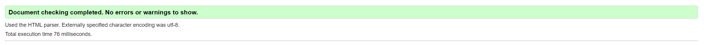
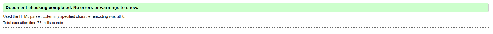
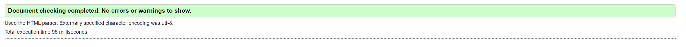
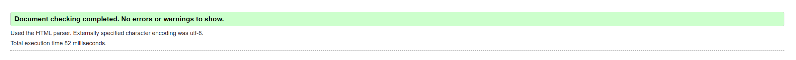
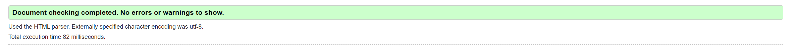
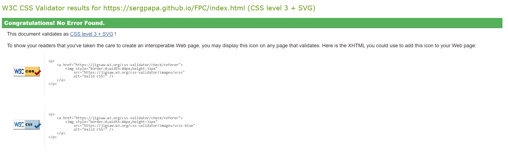
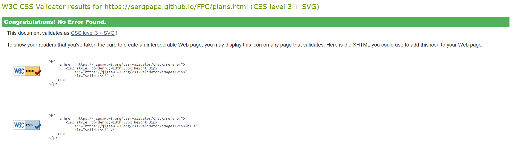
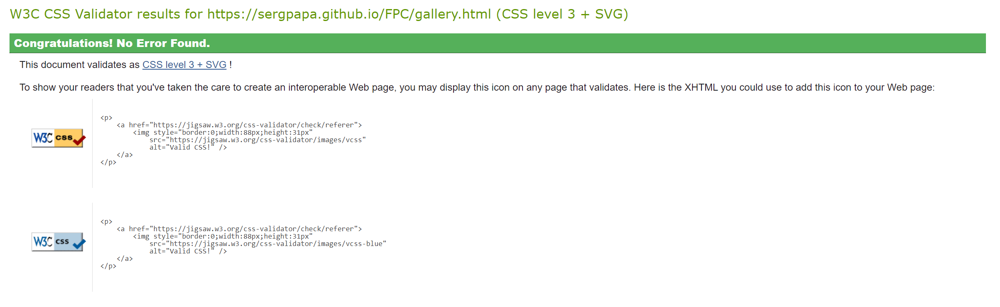
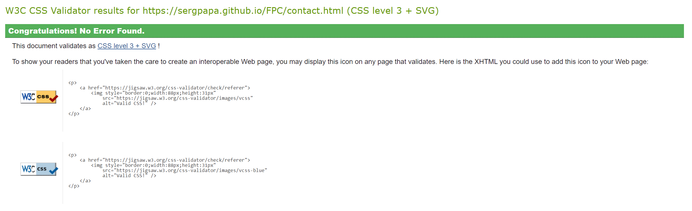
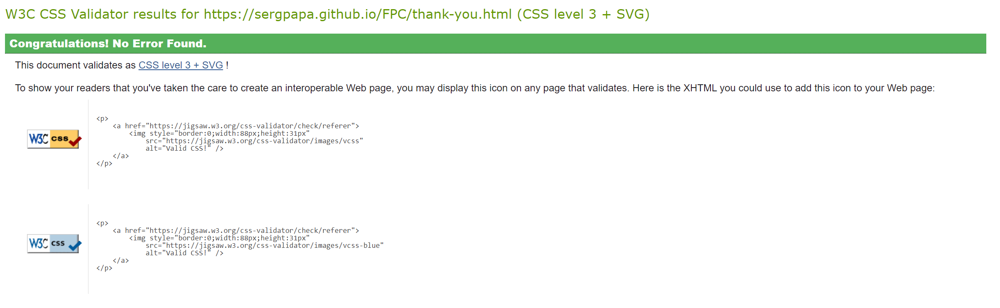

# TESTING 

The FPC has been tesytd manually as well as with automated services like code validators and browser developer tools.

## Code Validators

### [w3schools HTML Validator](https://validator.w3.org)

- [Home page](https://sergpapa.github.io/FPC/)
  
  

- [Plans page](https://sergpapa.github.io/FPC/plans.html)
  
  

- [Gallery page](https://sergpapa.github.io/FPC/gallery.html)
  
  

- [Contact page](https://sergpapa.github.io/FPC/contact.html)
  
  

- [Thank you page](https://sergpapa.github.io/FPC/thank-you.html)
  
  

### [w3schools CSS Validator](https://jigsaw.w3.org/css-validator/)

- [Home page](https://sergpapa.github.io/FPC/)
  
  

- [Plans page](https://sergpapa.github.io/FPC/plans.html)
  
  

- [Gallery page](https://sergpapa.github.io/FPC/gallery.html)
  
  

- [Contact page](https://sergpapa.github.io/FPC/contact.html)
  
  

- [Thank you page](https://sergpapa.github.io/FPC/thank-you.html)
  
  

## Responsiveness Test

## Browser Compatibility

FPC has been tested in multiple browsers with no visible issues. Google Chrome, Mozilla Firefox, Opera, Safari, Microsoft Edge.Appearance, functionality and responsiveness were found consistent throughout on a range of device sizes and browsers.

## Testing User Stories

## Known Bugs

## Additional Testing

### Lighthouse

